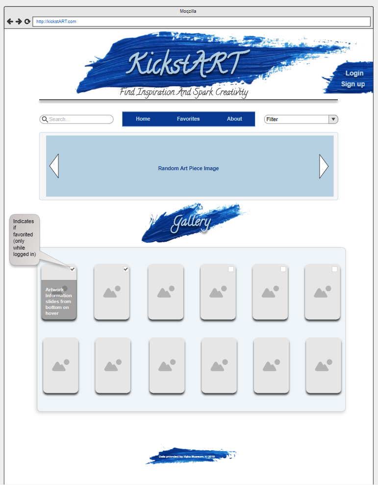
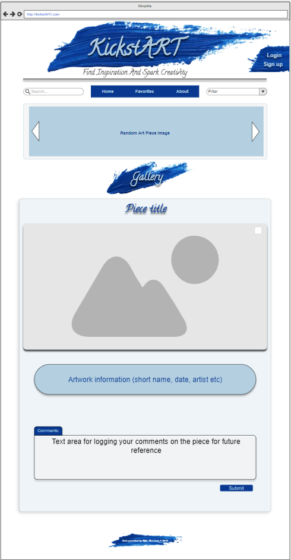

# kickstART  
https://derrickjfoster.github.io/search 

* kickstART is an app for creative minded people looking for project inspiration.

* User can create an account, browse through art, save their favorites and add creative notes.

* This app uses an API provided by Rijks Museum at http://rijksmuseum.github.io/.

* Created with React, Express, Node.js and Mongo.

